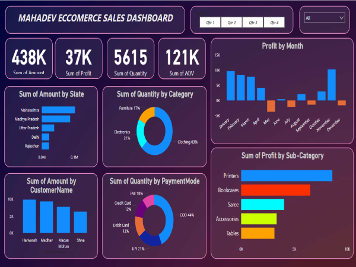

# Madhav Ecommerce Sales Dashboard

Owner of Madhav Store wants us to help them create a dashboard to track and analyze their online sales across India. 

## Screenshot

Here is a screenshot of the project:



## Description

• Created an interactive dashboard to track and analyze online sales data.

• Used complex parameters to drill down in worksheets and customized with filters and slicers.

• Created connections, joined new tables, and performed calculations to manipulate data and enable user-driven parameters for visualizations.

• Utilized various types of customized visualizations, including bar charts, pie charts, donut charts, clustered bar charts, scatter charts, line charts, area charts, maps, and slicers.

## Installation

Provide a step-by-step guide on how to install and set up your project.

1. Clone the repository:
   ```bash
   [git clone https://github.com/yourusername/your-repository.git](https://github.com/Shubhamdiwakarkadam/Ecommerce-sales-Dashboard-POWERBI-1.git)
